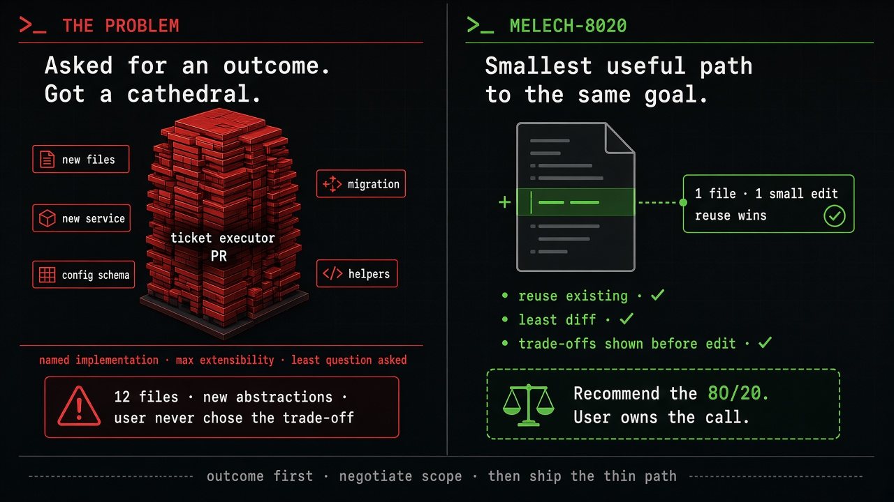

# `melech-8020` tip visual

#x-dev tip diagram (2026-09-24): **ticket-executor overscope** — asked for an outcome, got a cathedral (new files, services, migrations) vs the MELECH-8020 path (reuse existing, least diff, trade-offs shown before edit — user owns the 80/20 call).
