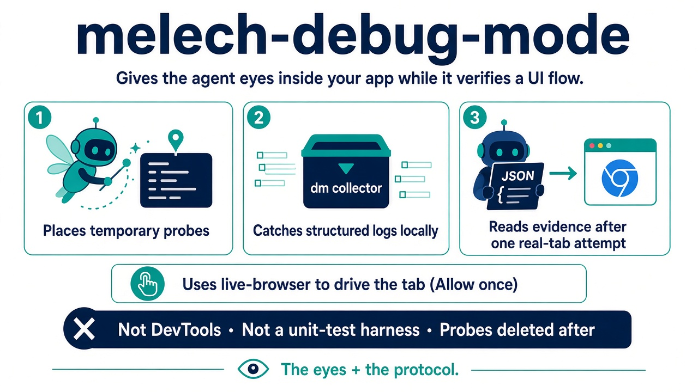
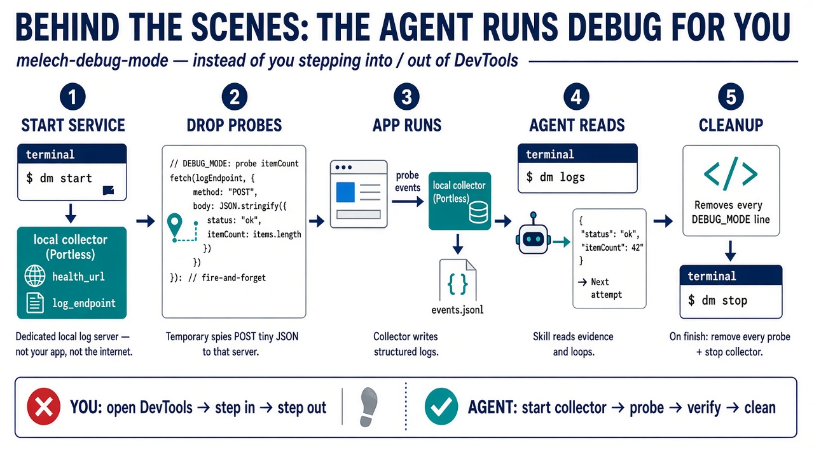

# `melech-debug-mode` tip visual

Joint #x-dev MELECH TIP with [`melech-live-browser`](../melech-live-browser/README.md) — **parent autonomy** for local UI work: without the pair, you click through flows yourself; with autopilot, the agent drives your existing Chrome tab end to end while this skill owns probes and evidence.

#x-dev tip diagram: **the eyes** — temporary runtime probes on frontend/backend boundaries, a local JSONL collector, streamed logs via `dm`, and clean teardown after the workflow. Autopilot pairs with `melech-live-browser` for tab attach and interaction; manual mode keeps you on the keyboard until you say `proceed`.
