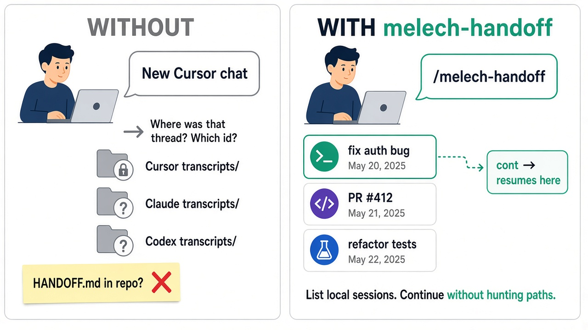
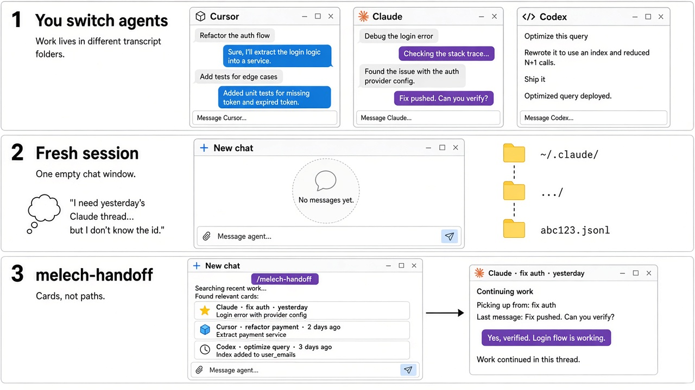
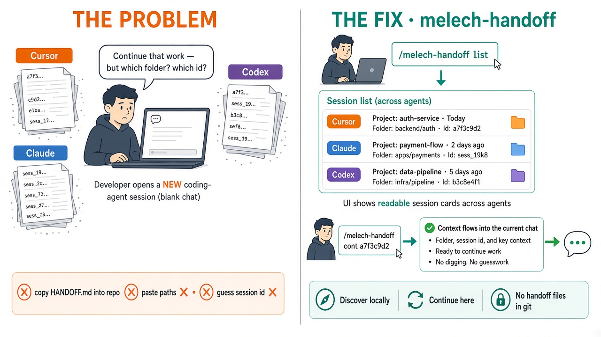

# `melech-handoff` tip visual

#x-dev tip diagram: **session continuity** — without `/melech-handoff`, you hunt paths and paste context; with it, you list recent transcripts in the worktree and continue by ID or intent.

Optional reference comics (same tip series):

