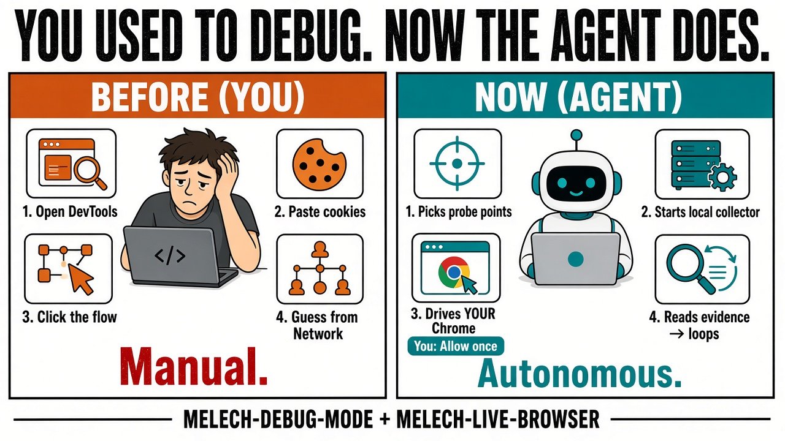
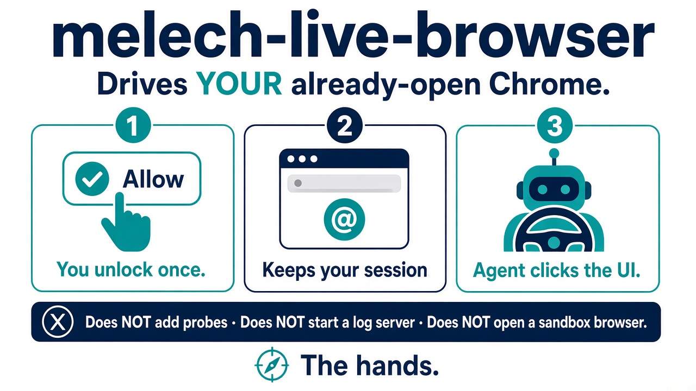

# `melech-live-browser` tip visual

Joint #x-dev MELECH TIP with [`melech-debug-mode`](../melech-debug-mode/README.md) — **parent autonomy** for local UI work: without the pair, you click through flows yourself; with autopilot, the agent drives your existing Chrome tab end to end while debug mode owns probes and evidence.

#x-dev tip diagram: **the hands** — `melech-live-browser` attaches to the Chrome tab you already have open (logged-in profile, real tabs), drives interaction through Chrome DevTools MCP, and keeps an explicit draft-versus-submit boundary. Debug mode calls it for autopilot reproduction; ordinary browser work stays here without starting a debugging collector.
