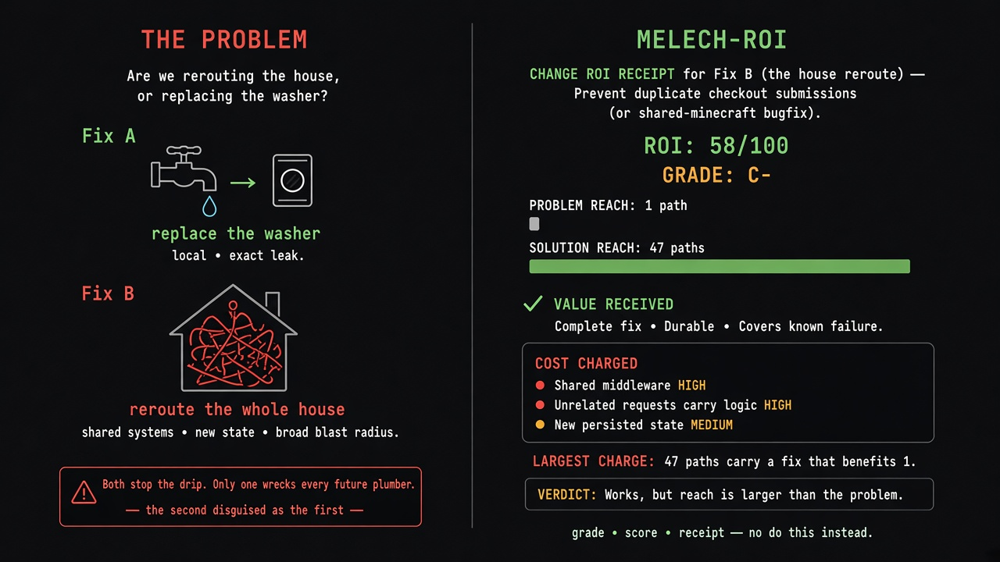

# `melech-roi` tip visual

#x-dev tip diagram (2026-09-23): **agent overscope** — are we rerouting the house to fix one drip, or replacing the washer at the exact leak? Left: the problem (Fix A washer vs Fix B whole-house reroute). Right: the MELECH-ROI receipt (problem reach vs solution reach, grade, score — no "do this instead").
